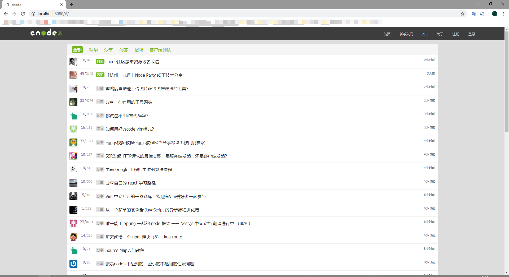
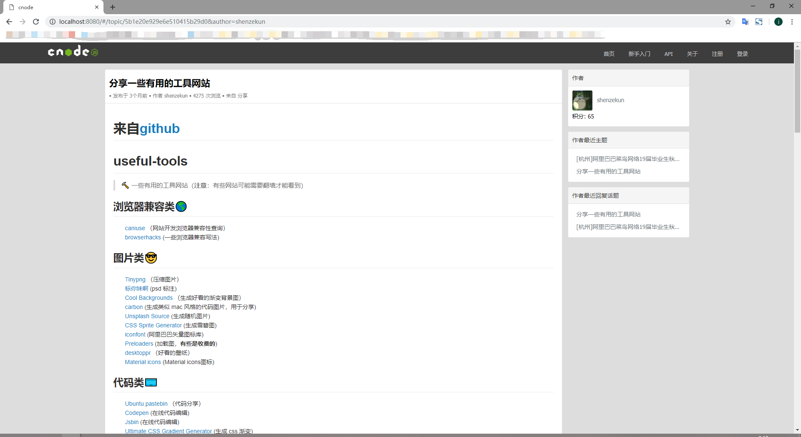
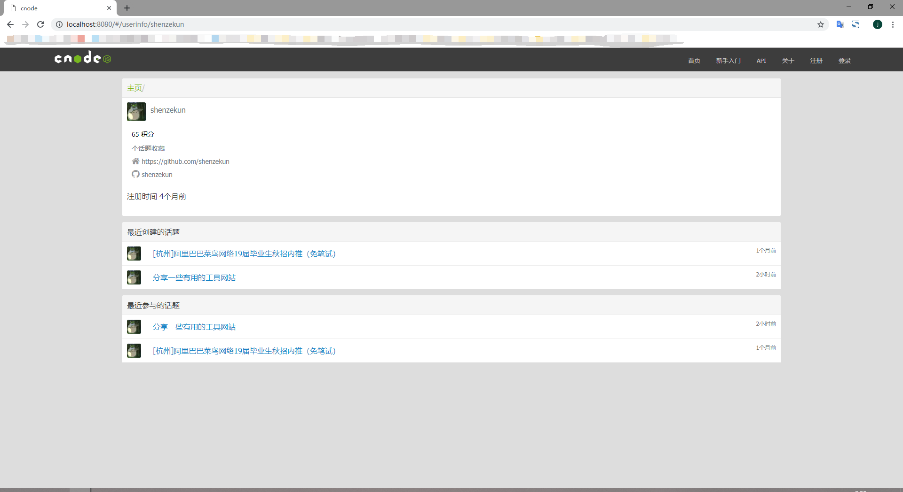

#### CNODE

**所用到的技术栈：**
- vue.js计算属性

- vue.js的内置指令和事件的绑定

- vue.js的自定义事件和触发

- vue-router路由的跳转和监听

- 父子组件之间的数据传递,

**模块组件**

Header模块

PostList模块

Article模块

Slider侧边栏模块

UserInfo用户个人中心模块

Pagination分页组件的开发

**图片展示**

首页展示（PostList组件）

帖子内容展示（Article组件）

用户详情（UserInfo组件）

在线预览地址：https://woqi.github.io/cover-CNODE/dist/index.html#/

**关于src文件使用方法：**

如果没有vue-cli，请全局安装

`npm install -g vue-cli`

全局安装完成后，进入你的项目

`cd 你的项目名称`

安装依赖

`npm install`

本地启动

`npm run dev`

可以在安装依赖完毕后将src文件替换掉

`vue install webpack 你的项目名称`

**小记：关于vue-cli搭建的项目如何在github上在线预览问题**

在你的vue项目中查找config这个文件夹进入index.js文件

`config/index.js`

修改该文件（index.js）的build组件

将`assetsPublicPath: '/',` 修改为`assetsPublicPath: './',`

进入`.gitignore`文件中删除`/dist/`

windows cmd中输入 npm run build 

常规上传到github，setting后即可支持在线预览

